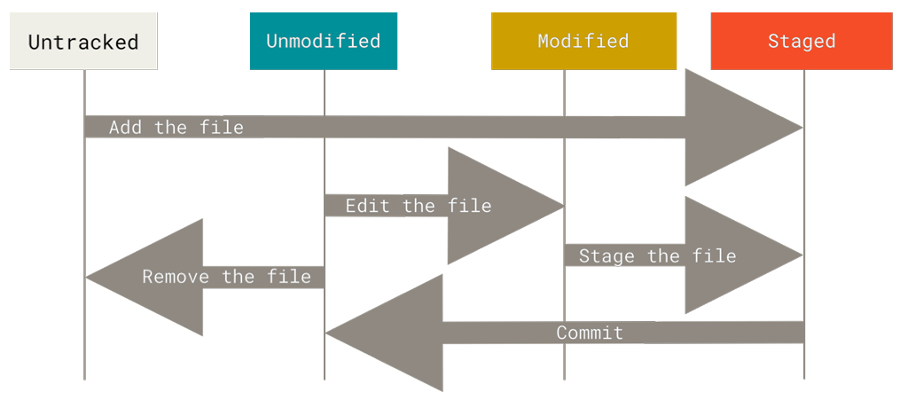

# Git Basics

##  Getting a Git Repository
You typically obtain a Git repository in one of two ways:
 1. You can take a local directory that is currently not under version control, and turn it into a Git
 repository, or
 2. You can clone an existing Git repository from elsewhere.

##  Initializing a Repository in an Existing Directory

cd C:/Users/user/my_project

git init

This creates a new subdirectory named .git that contains all of your necessary repository files — a Git repository skeleton

At this point, nothing in your project is tracked yet

## Cloning an Existing Repository
You clone a repository with git clone <url> or 

You clone a repository with git clone <url> '<foldername> target directory'

Every version of every file for the history of the project is pulled down by default when you run git clone

NB: In fact, if your server disk gets corrupted, you can often use nearly any of the clones on any client to set the server back to the state it was in when it was cloned (you may
 lose some server-side hooks and such, but all the versioned data would be there)

## Recording Changes to the Repository

### Each file in your working directory can be in one of two states: tracked or untracked
* Tracked files are files that were in the last snapshot, as well as any newly staged files;
- They can be unmodified, modified, or staged. 
- In short, tracked files are files that Git knows about.

* Untracked files are everything else — any files in your working directory that were not in your last snapshot and are not in your staging area. 
- When you first clone a repository, all of your files will be tracked and unmodified because Git just checked them out and you haven’t edited anything

- As you edit files, Git sees them as modified, because you’ve changed them since your last commit.
- As you work, you selectively stage these modified files and then commit all those staged changes,and the cycle repeats.

##  Checking the Status of Your Files
git <status> command